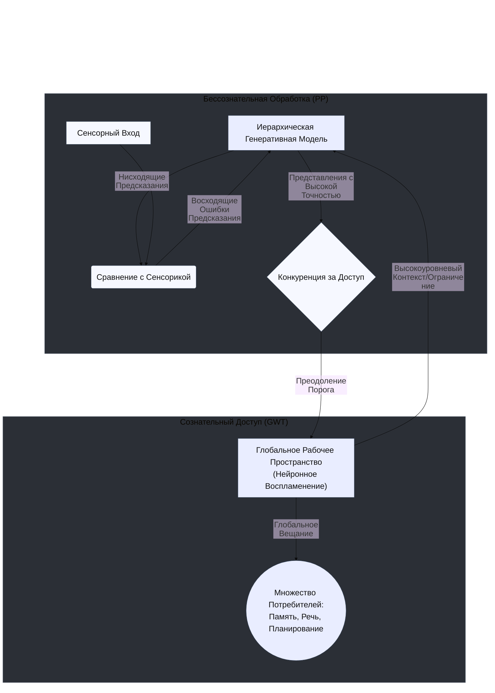

### 5.5 Интерфейс PP-GWT: Как Предсказания Выходят на Сцену?

Мы установили, что в ТЭПО/EPET Предиктивная Обработка (PP) генерирует содержание опыта, а Теория Глобального Рабочего Пространства (GWT) обеспечивает сознательный доступ к нему. Но как именно эти две сложные системы взаимодействуют? Описание этого **интерфейса PP-GWT** является ключевым для понимания того, как предсказательная машинерия мозга порождает единый, отчетный сознательный опыт.

Хотя детали этого интерфейса являются предметом активных исследований, EPET предлагает следующую гипотетическую модель, основанную на синтезе идей PP и GWT[^pp_gwt_integration_whyte][^pp_gwt_integration_alegiani].

**1. Что "Транслируется" в Глобальное Пространство?**

"Сцена" сознания в GWT имеет ограниченную емкость. Что именно из огромного потока предсказаний и ошибок, генерируемых PP, "выигрывает" конкуренцию за доступ и становится глобально доступным? EPET предполагает, что это могут быть два основных типа информации:

-   **Стабильные, Высокоуровневые Гипотезы/Предсказания:** Когда иерархическая модель PP достигает когерентного, стабильного и высокоточного состояния, объясняющего текущие сенсорные данные с минимальной ошибкой (например, "передо мной красное яблоко"), это **интегрированное, высокоуровневое содержание модели** может быть "выбрано" для глобального вещания. Это соответствует нашему обычному, стабильному восприятию мира.
    
-   **Значимые, Высокоточные Ошибки Предсказания:** Когда возникает **неожиданное, важное и надежное** рассогласование между предсказанием и реальностью (например, яблоко внезапно оказывается синим), этот **сигнал об ошибке с высокой присвоенной точностью (precision)** может "прорваться" в глобальное пространство. Это привлекает внимание, запускает широкомасштабное обновление модели и мобилизует когнитивные ресурсы для разрешения неопределенности.
    

**2. Механизм Доступа: Роль Точности (Precision) и "Воспламенения"**

Как происходит отбор и "трансляция"?

-   EPET предполагает, что **точность (precision)**, присвоенная различным представлениям (гипотезам или ошибкам) в иерархии PP, играет роль **"валюты" в конкуренции за доступ** к глобальному рабочему пространству.
    
-   Представление (гипотеза или ошибка) с наивысшей интегрированной точностью в данный момент времени имеет наибольшие шансы преодолеть порог доступа.
    
-   Преодоление этого порога соответствует **нейронному "воспламенению" (ignition)**, описанному в GNWT (Модуль 4). То есть, высокоточное представление в PP-иерархии вызывает каскадную, самоподдерживающуюся активацию в глобальной сети (префронтальная-теменная кора), делая свое содержание глобально доступным.
    

**3. Цикл Взаимодействия PP-GWT:**

Взаимодействие между PP и GWT – это не однонаправленный процесс, а **динамический цикл**:

1.  **Генерация (PP):** Иерархическая модель PP постоянно генерирует предсказания и вычисляет ошибки.
    
2.  **Конкуренция (PP -> GWT):** Представления с наибольшей точностью конкурируют за доступ.
    
3.  **"Воспламенение" и Вещание (GWT):** "Победившее" представление становится глобально доступным, его содержание "вещается" по всему мозгу.
    
4.  **Модуляция и Ограничение (GWT -> PP):** Содержание, находящееся в глобальном рабочем пространстве, действует как **высокоуровневый контекст или ограничение** для всей PP-иерархии. Оно стабилизирует восприятие и направляет последующие циклы предсказаний. Например, если в глобальном пространстве доминирует гипотеза "я нахожусь в лесу", это будет формировать предсказания о том, какие звуки и запахи я должен ожидать, модулируя обработку на более низких уровнях PP.
    
5.  **Обновление (GWT -> PP):** Если в GWT попадает значимая ошибка предсказания, это запускает глобальное обновление генеративной модели PP для ее объяснения.
    

**Схема Интерфейса PP-GWT в EPET:**

**Заключение:**

Модель интерфейса PP-GWT в рамках ТЭПО/EPET предлагает механистическое объяснение того, как динамические, распределенные вычисления в предсказательной иерархии приводят к возникновению единого, интегрированного и отчетного сознательного опыта. **Точность (precision)** выступает как ключевой механизм, регулирующий доступ, а само глобальное рабочее пространство, в свою очередь, модулирует и стабилизирует работу предсказательной машины. Этот синтез позволяет объединить сильные стороны обеих теорий, создавая более полную картину работы сознания.

В следующем, последнем разделе этого модуля мы посмотрим, как ТЭПО/EPET, вооруженная этим интегративным механизмом, предлагает по-новому взглянуть на классические мысленные эксперименты в философии сознания.

[^pp_gwt_integration_whyte]: Whyte, C. J. (2019). Integrating the Global Neuronal Workspace into the Framework of Predictive Processing: Towards a Working Hypothesis. *Consciousness and Cognition*, 73, 102763. https://doi.org/10.1016/j.concog.2019.102763
[^pp_gwt_integration_alegiani]: Alegiani, A., & Marraffa, M. (2021). Combining the Global Neuronal Workspace Theory of Consciousness with the Predictive Coding Theory. Prospects and Challenges from the Clinical Cognitive Neuroscience. *Reti, Saperi, Linguaggi*, 2, 215-234. https://doi.org/10.12832/102763
